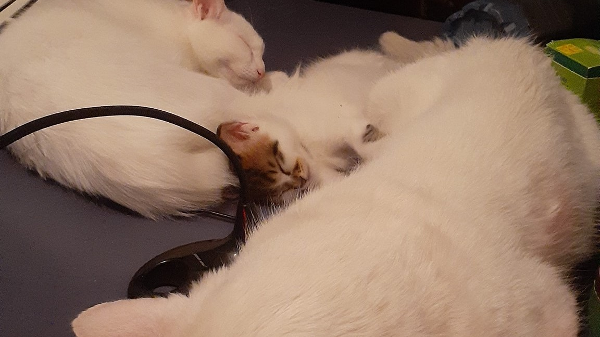

[📘repositories](./REPOS.md#repositories-and-gists)    [⭐starred](./STARRED.md#starred)    [➕contributions](./CONTRIBUTIONS.md#my-contributions)    [🖼️project gallery](./PROJECT_GALLERY.md#project-gallery)

<a href="https://github.com/YoraiLevi/winutil_tweaks_cli">
<picture>
<source media="(prefers-color-scheme: dark)" srcset="./assets/card-dark-0.svg/">
<source media="(prefers-color-scheme: light)" srcset="./assets/card-light-0.svg/">

</picture></a>
<a href="https://gist.github.com/YoraiLevi/0f333d520f502fdb1244cdf0524db6d2">
<picture>
<source media="(prefers-color-scheme: dark)" srcset="./assets/card-dark-1.svg/">
<source media="(prefers-color-scheme: light)" srcset="./assets/card-light-1.svg/">

</picture></a>
<a href="https://github.com/YoraiLevi/container_tooling_survey">
<picture>
<source media="(prefers-color-scheme: dark)" srcset="./assets/card-dark-2.svg/">
<source media="(prefers-color-scheme: light)" srcset="./assets/card-light-2.svg/">

</picture></a>
<a href="https://github.com/YoraiLevi/python_tooling_survey">
<picture>
<source media="(prefers-color-scheme: dark)" srcset="./assets/card-dark-3.svg/">
<source media="(prefers-color-scheme: light)" srcset="./assets/card-light-3.svg/">

</picture></a>
<a href="https://github.com/YoraiLevi/pip_installable_module">
<picture>
<source media="(prefers-color-scheme: dark)" srcset="./assets/card-dark-4.svg/">
<source media="(prefers-color-scheme: light)" srcset="./assets/card-light-4.svg/">

</picture></a>
<a href="https://github.com/YoraiLevi/dotfiles">
<picture>
<source media="(prefers-color-scheme: dark)" srcset="./assets/card-dark-5.svg/">
<source media="(prefers-color-scheme: light)" srcset="./assets/card-light-5.svg/">

</picture></a>

# My Most Starred🌟

<a href="https://gist.github.com/YoraiLevi/0f333d520f502fdb1244cdf0524db6d2">
<picture>
<source media="(prefers-color-scheme: dark)" srcset="./assets/card-dark-starred-0.svg/">
<source media="(prefers-color-scheme: light)" srcset="./assets/card-light-starred-0.svg/">

</picture></a>
<a href="https://gist.github.com/YoraiLevi/e1888ee1c06b34cb02d4b58b739301af">
<picture>
<source media="(prefers-color-scheme: dark)" srcset="./assets/card-dark-starred-1.svg/">
<source media="(prefers-color-scheme: light)" srcset="./assets/card-light-starred-1.svg/">

</picture></a>
<a href="https://github.com/YoraiLevi/SetFacebookPostsPrivate">
<picture>
<source media="(prefers-color-scheme: dark)" srcset="./assets/card-dark-starred-2.svg/">
<source media="(prefers-color-scheme: light)" srcset="./assets/card-light-starred-2.svg/">

</picture></a>
<a href="https://github.com/YoraiLevi/winutil_tweaks_cli">
<picture>
<source media="(prefers-color-scheme: dark)" srcset="./assets/card-dark-starred-3.svg/">
<source media="(prefers-color-scheme: light)" srcset="./assets/card-light-starred-3.svg/">

</picture></a>

